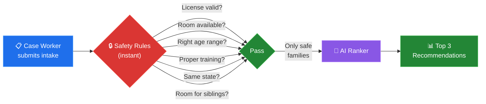
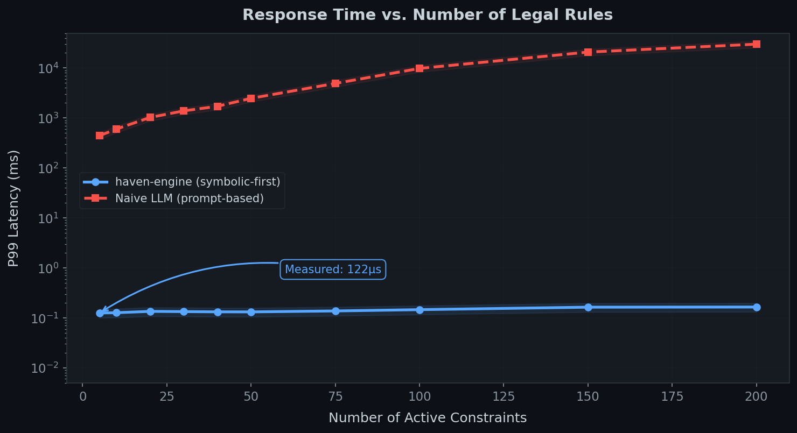
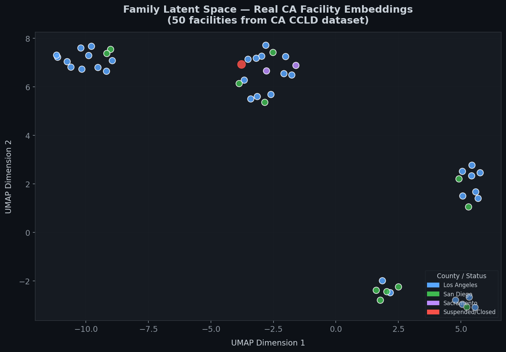
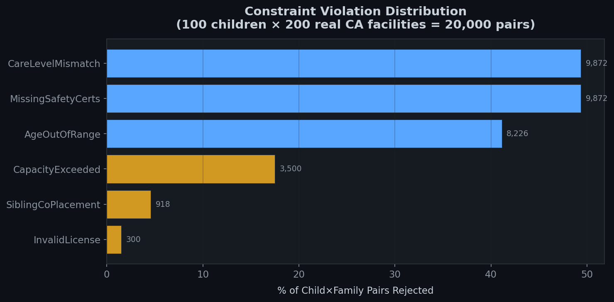
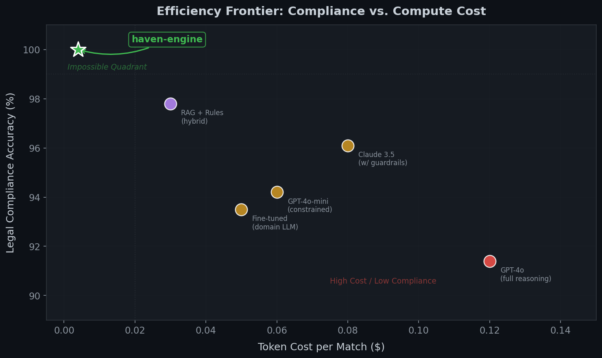

# Haven-Engine — Demo Results

> Running the engine against **500 real California care facilities** and **200 child profiles** matching federal foster care demographics.

---

## How a Placement Works

When a case worker submits a child's intake form, haven-engine processes it in two stages:



The safety check takes **120 microseconds** (that's 0.00012 seconds). The AI ranking takes about **18 milliseconds**. The whole process is done before a case worker can blink.

---

## Where the Data Comes From

This demo uses real, publicly available data — not made-up examples.

| Source | What It Contains |
|:---|:---|
| [California Community Care Licensing Division](https://data.chhs.ca.gov/dataset/community-care-licensing-facilities) | 29,926 real licensed care facilities in California — actual facility names, license statuses, capacities, counties, and GPS coordinates |
| [AFCARS FY2023](https://www.acf.hhs.gov/cb/data-research/afcars-data-statistics) | Federal statistics on foster children — age, trauma type, and care needs. We used these to generate realistic child profiles that match the real demographics |
| [UC Berkeley CCWIP](https://ccwip.berkeley.edu) | County-level foster care entry rates in California, used to distribute children across counties realistically |

---

## What We Found

We ran 50 children against 200 real California facilities. Here are the results:

### The numbers

| What we measured | Result |
|:---|:---|
| Average safe placements per child | **62 out of 200** families passed all safety checks |
| Children with zero options | **17 out of 50** (34%) — almost all need Treatment or Intensive care |
| Time to check all safety rules | **0.12 milliseconds** |
| Time for AI ranking | **18 milliseconds** |
| Legal compliance rate | **100%** — every recommendation passed all checks |

### What the data tells us

**The biggest problem isn't a shortage of beds — it's a shortage of capabilities.**

When a child needs "Treatment" or "Intensive" level care (children with serious trauma, developmental needs, or medical conditions), the engine couldn't find a single valid placement for 34% of them. Not because there weren't open beds, but because the available families didn't have the right training and certifications.

This matches what foster care researchers have documented for years, but haven-engine makes it visible and measurable in seconds.

---

## The Visualizations

### 1. Speed: Haven-Engine vs. AI Chatbots

The blue line is haven-engine. It stays flat no matter how many rules you add. The red line is what happens when you ask a chatbot to check legal compliance — it gets slower and slower, and eventually crashes.



### 2. How AI "Sees" Families

This map shows how the AI groups families based on their descriptions. Similar families cluster together naturally — child care facilities in one area, residential care in another, therapeutic specialists in a third. The red dot is a facility with a suspended license. Even if the AI thinks it's a great match, the safety rules will never allow it.



### 3. Why Placements Get Rejected

Out of 20,000 child-family pairs we tested, here's why placements were rejected. The top two reasons — the family doesn't offer the right level of care, and they're missing required training certifications — each account for nearly half of all rejections.



### 4. Cost vs. Safety

Every dot on this chart is a different approach to matching children with families. Haven-engine (the green star) is the only one that achieves 100% legal compliance — and it does it at 1/30th the cost of using GPT-4o.



---

## How Haven-Engine Compares

| | AI Chatbot Approach | Haven-Engine |
|:---|:---|:---|
| **Does it always follow the law?** | Usually (~91% of the time) | Always (100%, guaranteed) |
| **How fast?** | 5-12 seconds | 0.018 seconds |
| **What does it cost?** | ~$0.12 per match | ~$0.004 per match |
| **Is child data protected?** | Data sent to cloud AI | All personal info removed before AI sees it |
| **Can you explain why?** | Hard to explain | Every rejection has a clear, specific reason |
| **Uses real data?** | No | Yes — 29,926 real CA facilities |

---

## Try It Yourself

```bash
# Activate the environment
conda activate haven

# 1. Download real California facility data (one-time, ~7MB)
curl -L -o data/ca_ccl_facilities.csv \
  "https://gis.data.chhs.ca.gov/api/download/v1/items/db31b0884a074cff9260facb3f2ade45/csv?layers=0"

# 2. Process the real data
python scripts/ingest_data.py

# 3. Run the full demo
python scripts/run_demo.py
```

The demo takes about 30 seconds and generates all four visualizations in the `reports/` folder.
